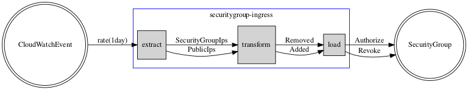

# Security Group Ingress

## Overview

There are three components to the ingress manager.

1. Cloudwatch Event Trigger
2. Lambda
3. Security Group



The cloudwatch event trigger is exactly what one would think, it fires an event every 1 day that triggering a lambda.

The lambda is a basic extract, transform, and load(ETL) process.  The extract phase extracts IPs from two sources.
Source #1 is the public IP source. This is the source of truth list.  Source #2 is the security group ingress rules.
The ingress rules is what is actually being allowed.  The Lambda then transforms these two lists into two other lists.
List #1 is a left outer join to determine which IPs need to be added.  List #2 is a right outer join to determine
which IPs need to be removed.  Finally, the last phase is the load phase.  The lambda takes the IPs to be added and
authorizes them on the security group and takes the iPs to be removed and revokes them on the security group.

The lambda currently only manages ipv4 ingress and not the ipv6 ingress.

## Testing

```bash
go test -v ./...
```
